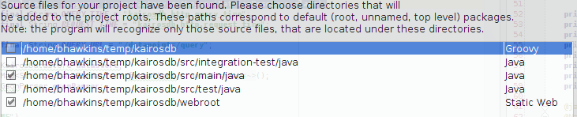
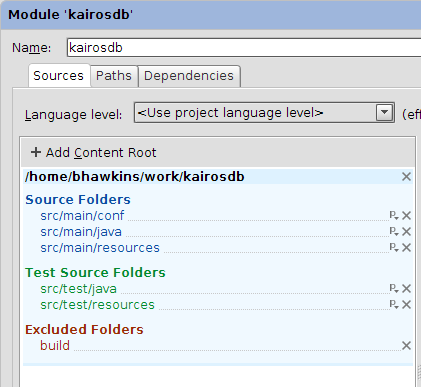
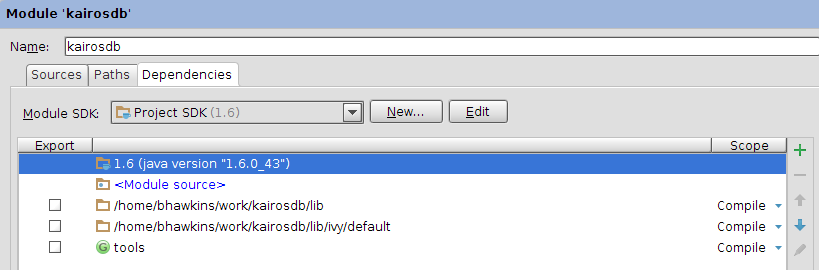

============================
Editing Kairos with IntelliJ
============================

--------------
Import Project
--------------

Go to File->Import Project

Select the root of the Kairosdb project.

Select the main source and web root modules.

Click next until the end.

-----------------
Configure Modules
-----------------

Once the project opens go to project settings (icon next to the wrench).  
Go to Modules and select the main module.

* Under the 'Sources' tab remove the existing content root and add a new one that points to the root of the project.  Then add the following source and test folders:

* Under the Dependencies tab change it to look like this

----------------------
Alternative Approach 1
----------------------

Create 'kairosdb.iml' at the root of your kairos project and copy the following into it:

.. code-block:: xml

  <module type="JAVA_MODULE" version="4">
    <component name="NewModuleRootManager" inherit-compiler-output="true">
      <exclude-output />
      <content url="file://$MODULE_DIR$">
        <sourceFolder url="file://$MODULE_DIR$/src/main/conf" isTestSource="false" />
        <sourceFolder url="file://$MODULE_DIR$/src/main/java" isTestSource="false" />
        <sourceFolder url="file://$MODULE_DIR$/src/main/resources" isTestSource="false" />
        <sourceFolder url="file://$MODULE_DIR$/src/test/java" isTestSource="true" />
        <sourceFolder url="file://$MODULE_DIR$/src/test/resources" isTestSource="true" />
        <excludeFolder url="file://$MODULE_DIR$/build" />
      </content>
      <orderEntry type="inheritedJdk" />
      <orderEntry type="sourceFolder" forTests="false" />
      <orderEntry type="module-library">
        <library>
          <CLASSES>
            <root url="file://$MODULE_DIR$/lib" />
          </CLASSES>
          <JAVADOC />
          <SOURCES>
            <root url="file://$MODULE_DIR$/lib" />
          </SOURCES>
          <jarDirectory url="file://$MODULE_DIR$/lib" recursive="false" />
          <jarDirectory url="file://$MODULE_DIR$/lib" recursive="false" type="SOURCES" />
        </library>
      </orderEntry>
      <orderEntry type="module-library">
        <library>
          <CLASSES>
            <root url="file://$MODULE_DIR$/lib/ivy/default" />
          </CLASSES>
          <JAVADOC />
          <SOURCES>
            <root url="file://$MODULE_DIR$/lib/ivy/default" />
          </SOURCES>
          <jarDirectory url="file://$MODULE_DIR$/lib/ivy/default" recursive="false" />
          <jarDirectory url="file://$MODULE_DIR$/lib/ivy/default" recursive="false" type="SOURCES" />
        </library>
      </orderEntry>
      <orderEntry type="library" name="tools" level="project" />
    </component>
  </module>

IntelliJ will see this as a new module and you can remove all the others it created during the initial import.

----------------------
Alternative Approach 2
----------------------
Install IvyIdea Plugin and restart

::

  git clone https://github.com/kairosdb/kairosdb.git
  cd kairosdb
  export CLASSPATH=tools/tablesaw-1.2.4.jar
  java make project-pom >> Will generate pom.xml

Now open IntelliJ and it should detect it as a Maven, should start resolving the dependencies.

Note: You might have to add some jars to the class path ( Alt + Enter) would give the the most appropriate libs.

----------------------
Alternative Approach 3
----------------------
Use Maven

Go to File->Open and select pom.xml. This will create a Maven project and download dependencies.

--------------
Running Kairos
--------------

You can configure IntelliJ to run kairos, you just need to call main and pass a single parameter to where you kairosdb.properties file is.

There is also a build switch to run Kairos so the debugger can be attached.
::

  java make run-debug

Will run kairos and listen on port 5005 for the debugger to attach which you can do from within IntelliJ.

The build script is also setup so you can place a kairosdb.properties file in the root of the project and it will use it instead of the one checked into the project.  This way you can develop with custom properties without messing with the one in the project.
